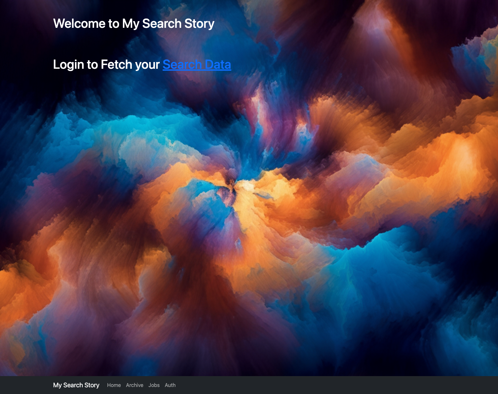
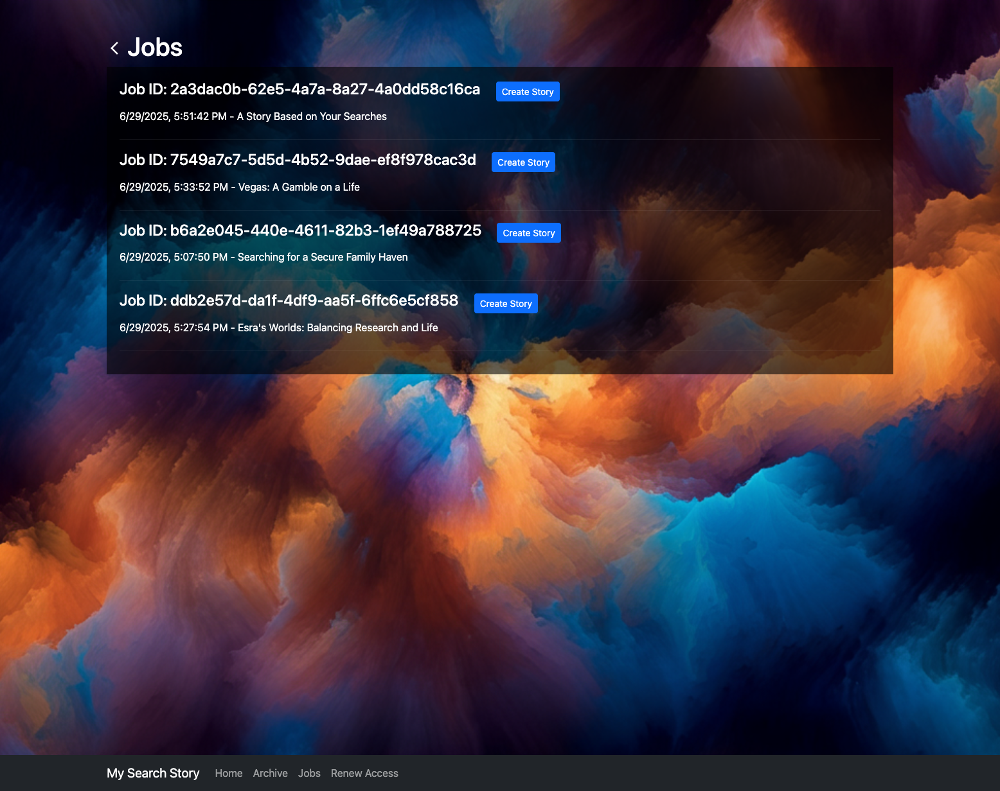
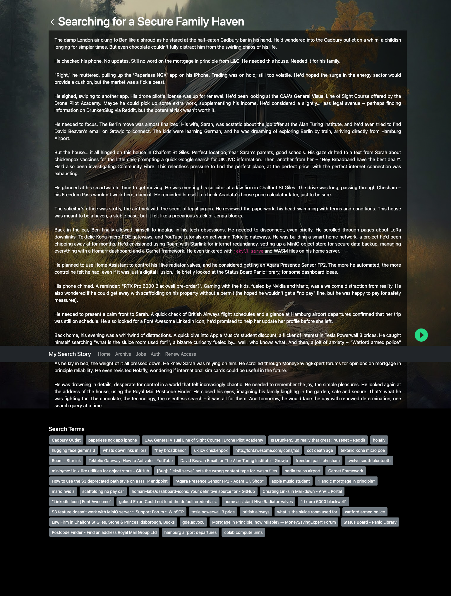

# 📖 My Search Story 🎨

Turn your Google search history into unique, AI-generated stories, complete with audio narration and a custom background image! ✨

This project uses the Google Data Portability API to fetch your search activity and then leverages Google's powerful Generative AI (Gemini and Imagen) to create a unique piece of art based on your digital footprint.  

#DataPortabilityAPI #BuildWithGemini #AISprint

**Note:** The Data Portability API is currently only available for end users in the European Economic Area (EEA) 

---

## 🖼️ Screenshots

<p align="center">
  
  &nbsp; &nbsp;
  
</p>
<p align="center">
  <em><b>Left:</b> The main page for fetching data. <b>Right:</b> The archive page, where you can browse all your past creations.</em>
</p>
<br>
<p align="center">
  
</p>
<p align="center">
  <em>A generated story with AI art and audio.</em>
</p>

---

## 🚀 How it Works

1.  **🔐 Authenticate:** Securely log in with your Google account. The app only asks for permission to access your search history via the Data Portability API.
2.  **🚚 Fetch Your Data:** Request an archive of your search history over a specific date range. The app will monitor the job status until your data is ready.
3.  **🤖 Generate Magic:** We pick a random selection of your search terms and feed them to Google's Gemini AI to write a completely unique short story.
4.  **🎧 Listen & See:** The generated story is converted to speech using Google's Text-to-Speech API, and a custom background image is generated with Imagen to match the story's theme.
5.  **📚 Enjoy Your Archive:** Browse all your generated stories, each a unique snapshot of your digital curiosity, saved locally on your machine.

---

## ✨ Features

- **AI Story Generation:** Uses Google's Gemini model to weave creative narratives from your search history.
- **Text-to-Speech Narration:** Listen to your stories with high-quality, natural-sounding voices from Google Cloud.
- **AI-Generated Imagery:** Each story gets a unique background image generated by Imagen to fit the narrative.
- **Secure & Private:** Your data is handled securely via Google's OAuth2 and Data Portability APIs. All generated stories and assets are stored locally on the machine running the server.
- **Personalized Archive:** Build a collection of stories that are uniquely yours, and browse them anytime.

---

## 🛠️ Tech Stack

- **Backend:** Node.js, Express.js
- **Frontend:** EJS (Embedded JavaScript templates)
- **Google Cloud Services:**
  - Google Identity (OAuth 2.0)
  - Data Portability API
  - Vertex AI (Gemini & Imagen models)
  - Text-to-Speech API
- **Key Libraries:** `googleapis`, `@google/generative-ai`, `@google-cloud/text-to-speech`, `dotenv`, `dayjs`, `uuid`, `jszip`.

---

## ⚙️ Setup and Installation

Follow these steps to get the project running on your local machine.

### Prerequisites

- Node.js (v16 or later recommended)
- A Google Cloud Platform (GCP) project

### Steps

1.  **Clone the repository:**
    ```bash
    git clone https://github.com/your-username/my-search-story.git
    cd my-search-story
    ```

2.  **Install dependencies:**
    ```bash
    npm install
    ```

3.  **Set up Google Cloud:**
    - In your GCP project, enable the following APIs:
        - **Data Portability API**
        - **Vertex AI API**
        - **Text-to-Speech API**
    - Go to "APIs & Services" -> "Credentials".
    - Click "+ CREATE CREDENTIALS" and choose "OAuth client ID".
    - Select "Web application" for the Application type.
    - Click "CREATE" and copy the **Client ID** and **Client Secret**.
    - Go back to the "Credentials" page, click "CREATE CREDENTIALS" and choose "API key". Copy the **API Key**.

4.  **Set up DPAPI**
    - Follow instructions to setup the Data Portability API - see https://developers.google.com/data-portability/user-guide/setup

5.  **Create a `.env` file:**
    Create a file named `.env` in the root of the project and add the following, replacing the placeholder values with your own credentials from the previous step.

    ```env
    # Application Port
    APP_PORT=3000

    # Google OAuth Credentials
    GOOGLE_CLIENT_ID=YOUR_GOOGLE_CLIENT_ID
    GOOGLE_CLIENT_SECRET=YOUR_GOOGLE_CLIENT_SECRET
    GOOGLE_REDIRECT_URL=http://localhost

    # Google Cloud Project & API Keys
    GCP_PROJECT_ID=YOUR_GCP_PROJECT_ID
    GOOGLE_GEN_API_KEY=YOUR_API_KEY_FOR_GEMINI
    ```
    > **Note:** For Text-to-Speech and Imagen (Vertex AI), this application uses Application Default Credentials (ADC). Make sure you are authenticated by running `gcloud auth application-default login` in your terminal.

---

## 🏃 Running the Application

1.  **Start the server:**
    ```bash
    npm start
    ```

2.  **Open your browser:**
    Navigate to `http://localhost:3000` (or the port you specified in your `.env` file).

---

## 🏃 Running the Application on Docker

1.  **Build the Docker image:**
    ```bash
    docker build -t my-search-story .
    ```

2.  **Run the Docker container:**
    ```bash
    docker run --rm -it \
        -p 3000:3000 \
        --env-file .env \
        -v "$(pwd)/data:/usr/src/app/data" \
        -v ~/.config/gcloud/application_default_credentials.json:/gcp/adc.json \
        -e GOOGLE_APPLICATION_CREDENTIALS=/gcp/adc.json \
        --name my-search-story-container \
        my-search-story
    ```

3.  **Open your browser:**
    Navigate to `http://localhost:3000` (or the port you specified in your `.env` file).

## ☁️ Deploying to Google Cloud Run (from GitHub)

You can deploy this project as a serverless container using Google Cloud Run and set up a CI/CD pipeline with Cloud Build.

[](https://deploy.cloud.run)

### 1. Prerequisites

- Ensure your GCP project is set up as described in the "Setup" section.
- Make sure the **Cloud Build API** and **Secret Manager API** are enabled in your GCP project.

### 2. Store Secrets in Secret Manager

Your API keys and client secrets should not be in your repository. Store them securely in Google Cloud's Secret Manager.

1.  In the GCP Console, go to **Security > Secret Manager**.
2.  Create secrets with the following names, using the values from your `.env` file:
    - `GOOGLE_CLIENT_ID`
    - `GOOGLE_CLIENT_SECRET`
    - `GOOGLE_GEN_API_KEY`

### 3. Add `cloudbuild.yaml`

Add the `cloudbuild.yaml` file (provided in the repository) to the root of your project. This file tells Cloud Build how to build and deploy your application.

### 4. Grant IAM Permissions

The Cloud Build service account needs permission to deploy to Cloud Run and access your secrets.

1.  In the GCP Console, go to **IAM & Admin > IAM**.
2.  Find the service account ending in `@cloudbuild.gserviceaccount.com`.
3.  Grant it the following roles:
    - `Cloud Run Admin`
    - `Service Account User`
    - `Secret Manager Secret Accessor`

### 5. Create the Cloud Build Trigger

1.  In the GCP Console, go to **Cloud Build > Triggers**.
2.  Click **Create trigger**.
3.  Configure the trigger:
    - **Event:** Push to a branch
    - **Source:** Connect your GitHub repository and select it.
    - **Branch:** `^main$` (or your default branch)
    - **Configuration:** Cloud Build configuration file
    - **Location:** `/cloudbuild.yaml`
4.  Click **Create**.

Now, every time you push to your main branch, Cloud Build will automatically deploy a new version of your service to Cloud Run!

> **Note on Data Persistence:** Cloud Run uses an ephemeral filesystem. This means any files saved to the `/data` directory will be lost when an instance restarts. For a production setup, you should modify the application to use Google Cloud Storage for saving and retrieving story data.

---

## 📂 Project Structure

```
/
├── data/         # Stores downloaded data archives and generated stories
├── static/       # CSS, client-side JS, and other static assets
├── views/        # EJS template files for the UI
├── main.js       # The main Express server file
├── package.json
└── README.md
```
